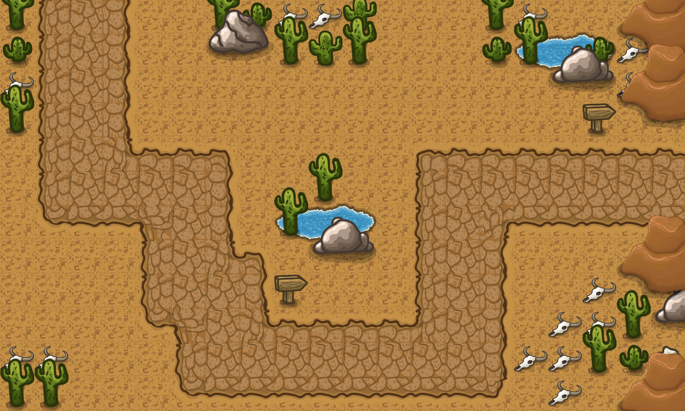
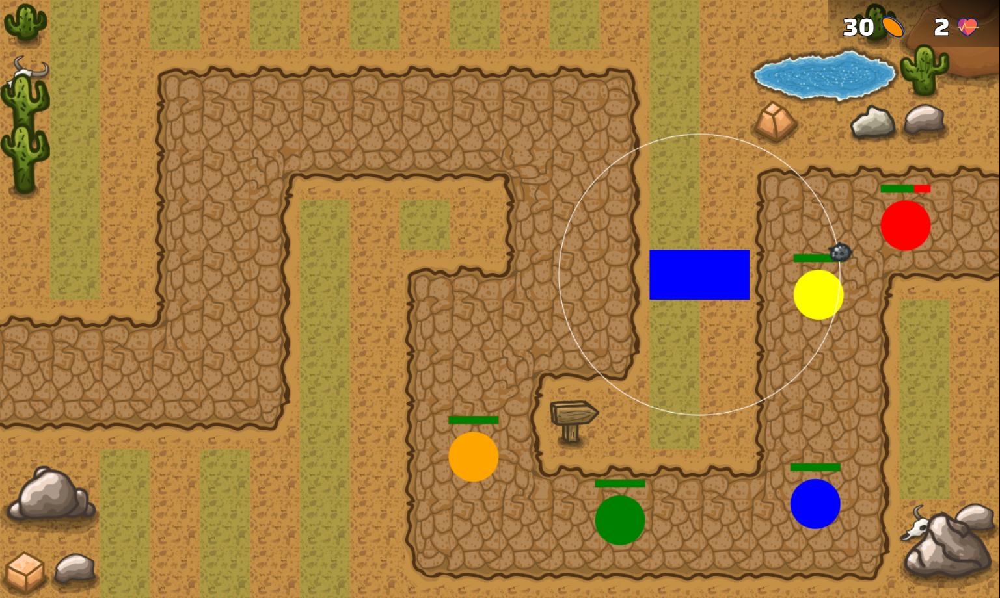
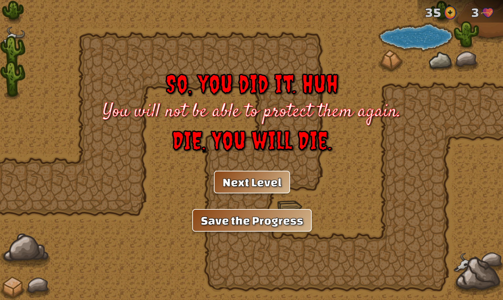
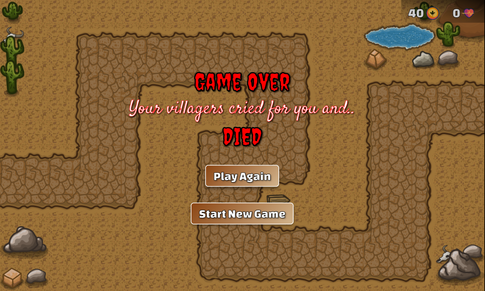

# Game Development | A Beginning

[](https://youtu.be/C4_iRLlPNFc?si=InMEAC4XuTwiRULY)

## Objectives:

1. Learn HTML5 Canvas
2. Learn CSS3
3. Refresh JavaScript
4. Learn Object Oriented Programming
5. Basic Game Development

---

# Tower Defense: Orc Invasion



[](https://arjunkapadia.github.io/Tower-Defense-Game/ "Play Tower Defense: Orc Invasion")

**Tower Defense: Orc Invasion** is a thrilling tower defense game where you, as a mechanical engineer, defend your village from waves of orcs. Strategically place projectile-throwing towers along their path to eliminate enemies before they reach your home!

---

## 🚀 Tech Stack

- **HTML5 Canvas**: For rendering the game visuals.
- **CSS3**: For styling and layout adjustments.
- **JavaScript**: For game logic and interactivity.

---

## 🌟 Features

- **Dynamic Wave System**: Increasingly challenging waves of orcs.
- **Tower Setup Mechanics**: Place towers to strategically eliminate orcs.
- **Point System**: Earn points for every kill and use them to deploy more towers.
- **Health System**: Your village health decreases if orcs reach the end of the path.
- **Game Over Mechanic**: Lose the game if three orcs make it to the village.

## 🚀 Beyond Tutorial 🌌

_Upcoming Features_

1. A Storyline.
2. Sound Effects.
3. More Levels other than Tutorial.
4. LocalStorage to save game progress.
5. Multiplayer support.
6. Scoreboard for top players.
7. Additional tower types and upgrades.

---

## 🎮 Gameplay Guide

1. **Objective**: Protect your home village from invading orcs by destroying them before they reach the end of the path.
2. **Controls**:
   - Click on the map to place towers.
   - Towers automatically shoot projectiles at nearby orcs.
3. **Rules**:
   - Earn points for every orc you eliminate.
   - Use points to set up additional towers.
   - If an orc reaches the end of the path, your health decreases.
   - The game ends if three orcs reach the end of the path.
4. **Strategy**: Place towers strategically to maximize damage across the path. Manage your resources wisely to defend against tougher waves.

---

## 📸 Screenshots

_A Game in Making..._

- Level Map Creation
  

- In Making Scene
  

- Level Pass Screen
  

- Game Over Screen
  

---

## 🛠️ How to Run

1. Clone this repository:
   ```bash
   git clone https://github.com/iParth08/Tower-Defense-Game.git
   ```
2. Navigate to the project directory:
   ```bash
   cd Tower-Defense-Game
   ```
3. Open `index.html` in your browser to play.

---

Feel free to reach out with feedback or suggestions! 😊

<!-- Add your own custom feedback Collector -->

---

## 🕷️🐞🕸️ Issues & Bug Potentials 🕸️🐞🕸️

_These are not problems, just things I learned along the way_

> These issues have already been fixed, they are just here for reference.

Flicker : replace forEach with a Reverse classic for loop

<!-- Add more sections as needed -->

Game Const : health (enemy, village), destruction (enmy, tower), score (kill and cost), wave (count) and level (rate and health, destruction), towertype (cost, range, attack, speed, range);

OutOfTheGate => villageHealth Drop, Player kill
